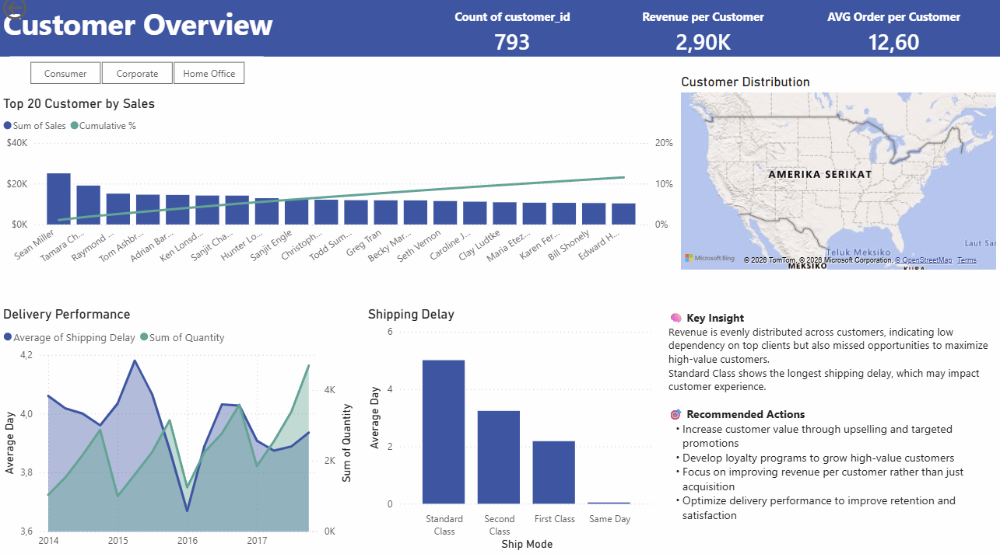

# Superstore Sales Analysis (SQL + Power BI)

## 📌 Project Overview

This project delivers an end-to-end sales analysis to uncover why strong revenue growth does not translate into high profitability.

Using SQL for data preparation and Power BI for visualization, the analysis identifies key drivers of profit loss, customer distribution patterns, and operational inefficiencies.

---

## ❓ Business Questions

* Why is profit margin relatively low despite growing revenue?
* How do discounts impact profitability?
* Which products and regions are driving inefficiencies?
* Is revenue concentrated among key customers?
* Are there operational issues affecting customer experience?

---

## 🛠 Tools Used

* SQL Server (SSMS) — data cleaning, transformation, and modeling
* Power BI — data modeling, DAX measures, and dashboard visualization

---

## 🧱 Data Model

The project uses a **star schema design** to ensure scalability and analytical efficiency:

* **Fact Table**: fact_sales (transaction-level data)
* **Dimension Tables**: dim_customer, dim_product, dim_location

---

## 📊 Dashboard Preview

### Page 1 – Executive Overview

(images/page1_overview.png)

### Page 2 – Customer Analysis

---

## 🔍 Key Insights

* Profit margin (12.47%) is low due to aggressive discounting (>30%), which frequently results in negative profit
* Several product categories generate strong revenue but reduce overall profitability
* Revenue is evenly distributed across customers, indicating stability but limited high-value customer leverage
* Standard shipping shows the longest delays, suggesting operational inefficiencies

---

## 🎯 Business Recommendations

* Limit discounts above 30%, especially for low-margin products
* Re-evaluate pricing strategy for unprofitable product categories
* Increase customer value through targeted upselling and retention strategies
* Improve delivery performance, particularly for Standard Class shipping

---

## 📁 Project Structure

* `/sql` → data preparation, cleaning, and transformation scripts
* `/powerbi` → dashboard file (.pbix)
* `/images` → dashboard previews
* `/docs` → detailed documentation

---

## 🚀 Conclusion

The business demonstrates strong revenue growth, but profitability is constrained by excessive discounting and operational inefficiencies.

The key opportunity lies in shifting focus from revenue growth to **profit optimization and customer value maximization**.
